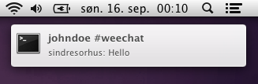

# WeeChat Notification Center

> [WeeChat](https://weechat.org) script to pass highlights and private messages to the OS X Notification Center

## Install

### Script center

- Install [pync](https://github.com/SeTeM/pync): `pip install pync`
- Copy `weechat.png` from this repository to `~/.weechat/weechat.png`
- In WeeChat, type `/script` to open the script manager
- Find `notification_center` and type `i` then `Enter` to install

### Manually

- Install [pync](https://github.com/SeTeM/pync): `pip install pync`
- Copy or symlink `weechat.png` to `~/.weechat/weechat.png`
- Copy or symlink `notification_center.py` into `~/.weechat/python/autoload/`

## Options

### show_highlights

Default: `'on'`  
Values: `'on'`, `'off'`

### show_private_message

Default: `'on'`  
Values: `'on'`, `'off'`

### show_message_text

Default: `'on'`  
Values: `'on'`, `'off'`

### sound

Default: `'off'`  
Values: `'on'`, `'off'`

### sound_name

Default: `'Pong'`  
Values: `'Basso'`, `'Blow'`, `'Bottle'`, `'Frog'`, `'Funk'`, `'Glass'`, `'Hero'`, `'Morse'`, `'Ping'`, `'Pop'`, `'Purr'`, `'Sosumi'`, `'Submarine'`, `'Tink'`, but can really be anything that has an aptly named sound file in `/System/Library/Sounds/`, `/Library/Sounds/`, or `~/Library/Sounds/`.

### activate_bundle_id

Default: `com.apple.Terminal`
Values: `'com.apple.Terminal'`, `'com.googlecode.iterm2'` or any bundle identifier that your terminal uses. The value for your app can be found in `/Applications/<MyTerminal>.app/Contents/Info.plist` right below the `CFBundleIdentifier` key.

## License

MIT © [Sindre Sorhus](http://sindresorhus.com)
